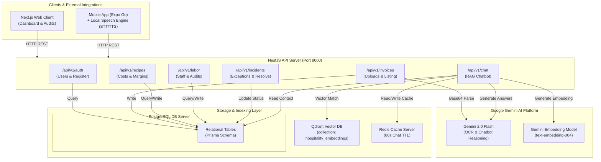
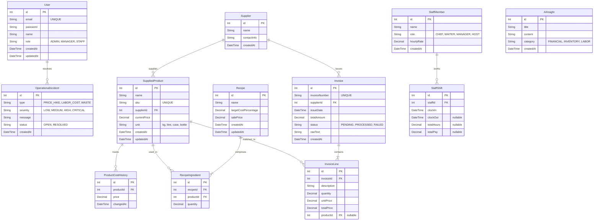
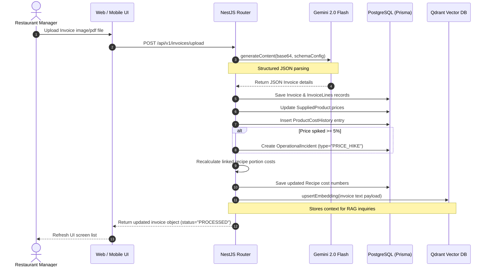
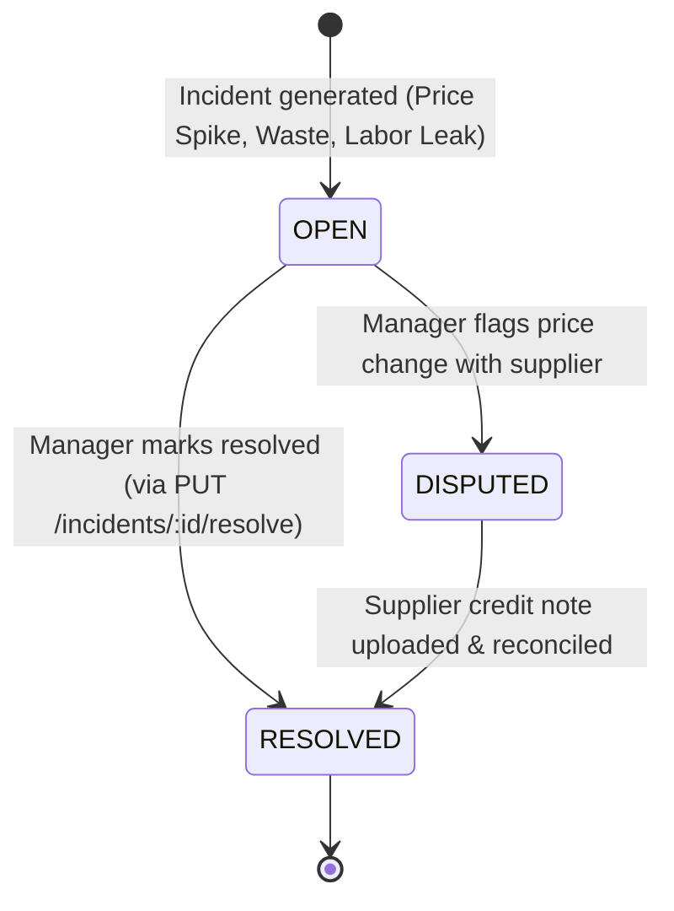

# Hospitality SaaS: Architecture, Flows, and Database Design

This document details the architectural blueprints, data flow lifecycles, and database schemas for the **Hospitality Decision Intelligence** SaaS platform. The application is built on a **NestJS Backend**, a **Next.js Web Client**, and an **Expo React Native Mobile Client**.

---

## 🗺️ Table of Contents

1. [High-Level System Architecture](#1-high-level-system-architecture)
2. [Database Entity-Relationship (ER) Schema](#2-database-entity-relationship-er-schema)
3. [Operational Workflows](#3-operational-workflows)
   - [3.1 Core Invoice Processing & Margin Recalculation](#31-core-invoice-processing--margin-recalculation)
     - [Data Flow Diagram](#data-flow-diagram)
     - [Processing Sequence Diagram](#processing-sequence-diagram)
   - [3.2 User Onboarding & Authorization](#32-user-onboarding--authorization)
   - [3.3 Inventory & Waste Audit Reconciliation](#33-inventory--waste-audit-reconciliation)
   - [3.4 Dispute & Exception Life Cycles](#34-dispute--exception-life-cycles)
   - [3.5 Siri-Style AI assistant & RAG Flow](#35-siri-style-ai-assistant--rag-flow)
   - [3.6 Labor Cost Audits & Ratio Calculations](#36-labor-cost-audits--ratio-calculations)

---

## 1. High-Level System Architecture

This blueprint illustrates the system boundaries, API routers, caching, databases, and third-party AI service connections forming our decision-intelligence loop.



---

## 2. Database Entity-Relationship (ER) Schema

This schema defines our PostgreSQL database structure. It aligns exactly with `prisma/schema.prisma` in our codebase, utilizing autoincremented `Int` keys instead of UUIDs.



### Table Dictionary

| Entity Name | Primary Key | Key Relations | Business Purpose |
| :--- | :--- | :--- | :--- |
| `User` | `Int` (Autoincrement) | Resolves `OperationalIncident` | Authentication profiles. |
| `Supplier` | `Int` (Autoincrement) | Linked to `SuppliedProduct` & `Invoice` | Supplier detail listings. |
| `SuppliedProduct` | `Int` (Autoincrement) | Linked to `Supplier`, `ProductCostHistory` | Raw inventory master records. |
| `ProductCostHistory` | `Int` (Autoincrement) | Linked to `SuppliedProduct` | Cost logs over time to track pricing. |
| `Recipe` | `Int` (Autoincrement) | Linked to `RecipeIngredient` | Menu structures and pricing margins. |
| `RecipeIngredient` | `Int` (Autoincrement) | Linked to `Recipe` and `SuppliedProduct` | Quantity values of items in a portion. |
| `Invoice` / `InvoiceLine` | `Int` (Autoincrement) | Linked to `Supplier` and `SuppliedProduct` | Parsed bills and item mappings. |
| `StaffMember` | `Int` (Autoincrement) | Linked to `StaffShift` | Staff profiles and wage details. |
| `StaffShift` | `Int` (Autoincrement) | Linked to `StaffMember` | Clock-in payroll logs. |
| `OperationalIncident` | `Int` (Autoincrement) | - | Timeline exception tracking logs. |
| `AIInsight` | `Int` (Autoincrement) | - | High-level reports generated by Gemini. |

---

## 3. Operational Workflows

### 3.1 Core Invoice Processing & Margin Recalculation

This workflow manages invoice parsing, product catalog updates, and portion cost impacts.

#### Data Flow Diagram
```
Manager takes photo of paper invoice (Mobile)
   │
   └── POST /api/v1/invoices/upload 
          │
          ├── Convert file buffer to base64 inline data
          ├── Call Gemini 2.0 Flash with JSON responseSchema
          │      └── Returns structured JSON elements
          │
          ├── Create Invoice & InvoiceLines (status="PENDING")
          ├── Match lines to SuppliedProduct using SKU/description similarity
          │      ├── If confidence >= 85%: Auto-link to product
          │      └── If confidence < 85%: Set status="NEEDS_REVIEW" for user audit
          │
          ├── Update SuppliedProduct currentPrice in database
          ├── Save ProductCostHistory log entry
          │
          ├── Verify Price Hike: If price increase >= 5%:
          │      └── Create 'PRICE_HIKE' OperationalIncident with status='OPEN'
          │
          └── For each affected Recipe:
                 ├── Recalculate portion cost sum of ingredients
                 ├── Compare actual cost % vs targetCostPercentage
                 └── If actual cost > target: Create 'MARGIN_ALERT' Incident
```

#### Processing Sequence Diagram


---

### 3.2 User Onboarding & Authorization

* **Endpoint:** `POST /api/v1/auth/register` & `POST /api/v1/auth/login`
* **Workflow:**
  1. The user registers a profile. Passwords are encrypted using `bcrypt` (10 rounds).
  2. During login, the server validates credentials against the `User` table.
  3. Returns a signed JSON Web Token (JWT) payload containing `{ email, sub: userId, role }` and user properties.
  4. Client stores the token in local storage (`useAuthStore` Zustand) and attaches it as `Authorization: Bearer <token>` on all outgoing calls.

---

### 3.3 Inventory & Waste Audit Reconciliation

* **Workflow:**
  1. Staff notices spoilage or broken stock.
  2. Enters parameters (Product, Quantity, and Reason) in UI.
  3. API inserts record into database. This cost value is aggregated as non-productive COGS and flagged as waste.
  4. During weekly physical inventory checks, actual shelf counts are compared to theoretical balances (Previous Stock + Invoiced Stock - POS Sales - Logged Waste).
  5. Any remaining variance generates an `OperationalIncident` alert if the discrepancy value exceeds a $50 tolerance limit.

---

### 3.4 Dispute & Exception Life Cycles

This flow tracks operational incidents until resolution.



* **API Endpoint:** `PUT /api/v1/incidents/:id/resolve` (marks status as `RESOLVED`).

---

### 3.5 Siri-Style AI Assistant & RAG Flow

This workflow answers operational inquiries in natural language, combining live metrics with cached answers.

* **API Endpoint:** `GET /api/v1/chat/query?q=<query_string>`
* **Execution Sequence:**
  1. **Cache Lookup:** Checks Redis for key matching the query. If a cache hit occurs, returns answer directly.
  2. **Vector Retrieval:** Generates search query embedding using Gemini `text-embedding-004` (768 dimensions) and queries Qdrant to find matching invoice text chunks.
  3. **Live Context Query:** Fetches live database metrics (open incidents, recent staff shifts, recipe margins).
  4. **AI Generation:** Invokes Gemini 2.0 Flash to synthesize live database context and vector contexts.
  5. **Cache Hydration:** Saves answer in Redis under `cache:chat:<query>` with a 60-second TTL.
  6. **TTS Output:** Mobile client reads the answer aloud using native Android/iOS Text-to-Speech engines.

---

### 3.6 Labor Cost Audits & Ratio Calculations

Audits scheduling schedules to detect wage leakage.

* **API Endpoint:** `POST /api/v1/labor/audit` (request body: `{ "estimatedSales": number }`)
* **Logic:**
  1. Retrieves all staff member hourly rates.
  2. Estimates active shift payroll costs for the day.
  3. Computes the **Labor Ratio**:
     $$\text{Labor Ratio} = \frac{\text{Projected Daily Payroll Cost}}{\text{Estimated Sales Revenue}} \times 100$$
  4. If Labor Ratio exceeds **30.0%**:
     * Inserts an `OperationalIncident` with type `labor_cost_leakage` and severity `CRITICAL`.
     * Invokes Gemini to suggest schedule modifications (e.g. *"Reduce waitress staff by 1 on quiet Monday dinner shifts"*).
  5. Returns calculated percentage and recommendations list.
