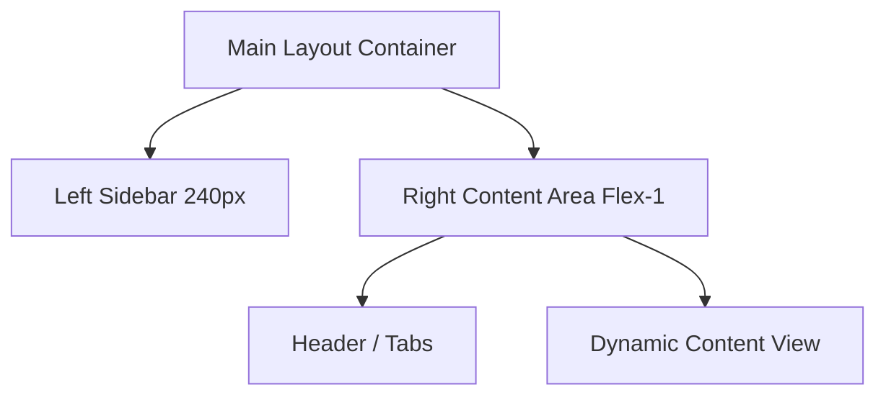

# Staff Costs UI Design Specification

This document outlines the UI design system, layout, component architecture, and interactive behavior for the **Staff Costs** module, modeled directly from the Haddock application snapshots. It defines a clean, premium, and modern hospitality SaaS administration interface.

---

## 1. Visual Design & Style System

### 1.1 Color Palette
The interface uses a curated, premium color palette characterized by subtle contrast, clean white containers, and a vibrant purple-blue accent.

| Element | Color Hex | Description |
| :--- | :--- | :--- |
| **Canvas Background** | `#f5f6f8` | Soft off-white for the main content workspace. |
| **Sidebar Background** | `#ffffff` | Clean white to separate navigation from content. |
| **Card / Panel Background** | `#ffffff` | Floating white containers with soft shadows. |
| **Primary Accent** | `#3b21f3` | Deep purple-blue used for primary buttons, active toggles, and primary text highlights. |
| **Primary Text** | `#1e293b` | Slate 800 for high-contrast headings and labels. |
| **Secondary Text** | `#64748b` | Slate 500 for descriptive subtexts, placeholders, and descriptions. |
| **Border / Divider** | `#e2e8f0` | Slate 200 for thin boundaries. |
| **Waiter/Waitress Tag** | BG: `#f3e8ff`, Text: `#6d28d9` | Light purple badge representing service staff. |
| **Cleaning Tag** | BG: `#fae8ff`, Text: `#a21caf` | Pink/magenta badge representing housekeeping staff. |
| **Director Tag** | BG: `#dbeafe`, Text: `#1d4ed8` | Blue badge representing management staff. |

### 1.2 Typography & Hierarchy
* **Primary Font Family**: `Inter`, `-apple-system`, `BlinkMacSystemFont`, `sans-serif`.
* **Titles (H1)**: `28px`, semi-bold (600), line-height `1.2`, color `#1e293b`.
* **Sub-sections (H2/H3)**: `18px`, semi-bold (600), color `#1e293b`.
* **Body / Label Text**: `14px`, medium (500) or regular (400), color `#334155`.
* **Subtext / Helper Text**: `12px` or `13px`, regular (400), color `#64748b`.

### 1.3 Shadow & Radii
* **Border Radius**: 
  - Cards & Content Areas: `8px` or `12px` (`rounded-lg` / `rounded-xl`).
  - Inputs & Buttons: `6px` or `8px`.
  - Badges & Toggles: `9999px` (fully rounded).
* **Box Shadows**:
  - Cards: `0 1px 3px rgba(0, 0, 0, 0.05), 0 1px 2px rgba(0, 0, 0, 0.02)`.
  - Modals / Dropdowns: `0 10px 15px -3px rgba(0, 0, 0, 0.1), 0 4px 6px -2px rgba(0, 0, 0, 0.05)`.

---

## 2. Layout Structure

The layout is split into two primary columns: the **Left Navigation Sidebar** and the **Right Content Area**.



### 2.1 Left Navigation Sidebar
* **Width**: `240px` fixed, full height (`100vh`).
* **Header**: Contains restaurant selector (dropdown showing restaurant logo, name, and address) and sidebar toggle/collapse button.
* **Sections**: Categorized menu groups:
  - **Business**: Home, Dashboard, Salts
  - **Agents**: Fine
  - **Treasury**: Banks
  - **Administration**: Documents, Reconciliation, **Staff costs** (Active/highlighted with light background and `#1e293b` font color).
  - **Stocks**: Inventories, Recipes, Products.
* **Footer**: Support option, User profile selector.

---

## 3. Screen-by-Screen Component Breakdown

### 3.1 Screen 1: Employee Directory (Staff Costs Master)

The entry screen displays the staff list and total costs overview.

```
+-------------------------------------------------------------------------+
|  Staff costs                                              Learn more [>]|
|  [ Employees ]  [ Payrolls and other costs ]                            |
|  +--------------------------------------------+   +------------------+  |
|  | Q Search by employee name, email or role   |   | + Add new empl.  |  |
|  +--------------------------------------------+   +------------------+  |
|                                                                         |
|  My employees                                                           |
|  +-------------------------------------------------------------------+  |
|  | [Waiter/Waitress] Alejandro Bello Simanca Jaider    (Toggle)  [>] |  |
|  | Jaider503@gmail.com                                               |  |
|  +-------------------------------------------------------------------+  |
|  | [Cleaning] Cheema Ibrar                             (Toggle)  [>] |  |
|  | ibrarcheema042@gmail.com                                          |  |
|  +-------------------------------------------------------------------+  |
+-------------------------------------------------------------------------+
```

* **Search Bar**: A full-width input block with a search icon (magnifying glass) and a placeholder `"Search by employee name, email or role"`. Light gray border with focus color matching the primary accent.
* **"Add new employee" Button**: Primary button (`#3b21f3` background) with a plus icon (`+`) and white text.
* **Employee List Cards**:
  - Individual white cards with a thin bottom border or spacing.
  - Left side: Role badge (colored by category) followed by the employee's name in bold, with their email address in grey underneath.
  - Right side: Standard iOS-style slide toggle (representing Active/Inactive status) and a chevron pointing right `>` for navigation.

---

### 3.2 Screen 2: Employee Profile Details (General Tab)

Clicking on an employee opens their detail page.

```
+-------------------------------------------------------------------------+
|  < Staff costs                                                          |
|  Alejandro Bello Simanca Jaider                                         |
|  [ General ]  [ Payrolls and other costs ]                              |
|                                                                         |
|  +-----------------------------------+   +---------------------------+  |
|  | Employee details                  |   | Active employee  (Toggle) |  |
|  | Name: Alejandro Bello...          |   | This employee is active...|  |
|  | Role: [Waiter/Waitress]           |   +---------------------------+  |
|  | Email: Jaider503@gmail.com        |   +---------------------------+  |
|  | Phone: 651318570                  |   | Notes & observations [Add]|  |
|  | Govt ID: -     Weekly hours: -    |   |                           |  |
|  |             [Edit] [Three-Dots]   |   | Write notes related...    |  |
|  +-----------------------------------+   +---------------------------+  |
+-------------------------------------------------------------------------+
```

* **Header Navigation**: Back arrow with "< Staff costs" breadcrumb link. Large employee name title.
* **Tab Navigation**: Sub-tabs for "General" (active) and "Payrolls and other costs".
* **Split Grid Layout**:
  - **Left Panel (2/3 width)**: **Employee Details Card**
    - Key-value list: Employee name, Role (badge style), Email address, Phone, Government ID, Weekly hours.
    - Bottom Actions: A secondary "Edit" button and an overflow menu button (three vertical dots).
  - **Right Panel (1/3 width)**: **Status & Notes Cards**
    - **Active employee Switch Card**: Contains a slide toggle at the top right and helper text: *"This employee is active, so he/she will appear in the payroll upload process. Mark it as inactive if he/she stops working temporarily or permanently."*
    - **Notes & Observations Card**: Displays a header with an "Add" button, and a text block showing notes or prompting *"Write notes or observations related to the employee"*.

---

### 3.3 Screen 3: Employee Profile Details (Payrolls and Other Costs Tab)

Shows the financial log attached to the specific worker.

* **Header Action Row**:
  - **"Add payroll expense"**: Primary accent button with user-group icon.
  - **"Add another expense"**: Secondary outline button with a plus icon.
* **Payrolls Table**:
  - Columns: **Month** and **Total**.
  - Right footer link: `"See for all employees"` to return to the global financial payroll summary.
  - Empty state: Blank space or placeholder if no records exist for the month.

---

## 4. Modals and Interactions

### 4.1 Add Employee Modal
Triggered by clicking the **"+ Add new employee"** button on the main employee list.

* **Modal Layout**: Centered card layout with a close `x` icon at the top right.
* **Form Fields**:
  - *Employee name* (Input, Text, placeholder `"Employee name. Eg: Captain Haddock"`, focused state has blue/purple border).
  - *Role \** (Select dropdown, Required, placeholder `"Select or create a role"`).
  - *Email address* (Input, Email, placeholder `"Enter the email address. Eg: captain@haddock.app"`).
  - *Government ID* (Input, Text, placeholder `"Eg: 12345678X"`).
  - *Weekly hours* (Input, Number with scroll increment/decrement stepper, placeholder empty).
  - *Phone* (Input, Tel, placeholder `"Eg: 612 345 678"`).
  - *Notes and observations* (Textarea, placeholder `"Write notes or observations related to the employee"`).
* **Footer Controls**: Positioned on the **bottom-left** of the card:
  - "Cancel" (Secondary flat button).
  - "Add" (Primary accent button, purple-blue background, white text).

### 4.2 Edit Employee Details Modal
Triggered by clicking the **"Edit"** button on the Employee Details card.

* **Modal Box Layout**: Medium size modal centered on a dark semi-transparent backdrop.
* **Form Grid**:
  - **Row 1**:
    - *Employee name \** (Input, Text, Required, pre-filled, blue outline on focus).
    - *Role \** (Select Dropdown, Required, options for roles: Waiter/Waitress, Cleaning, Director, etc.).
  - **Row 2**:
    - *Email address* (Input, Email).
    - *Phone* (Input, Tel).
  - **Row 3**:
    - *Government ID* (Input, Text, placeholder `"Eg: 12345678X"`).
    - *Weekly hours* (Input, Number).
* **Footer Controls**: Aligned to the **bottom-right** of the card:
  - "Cancel" (Secondary flat button).
  - "Save" (Primary accent button, purple-blue background, white text).

### 4.3 Add Payroll Expense Modal (Batch Upload)
Triggered by clicking the **"Add payroll expense"** button in the employee's payrolls tab or the global payroll actions.

```
+-------------------------------------------------------------+
|  Add payroll expense                                     x  |
|                                                             |
|  Date and configuration *                                   |
|  [Select date  (icon)]                                      |
|                                                             |
|  Enter with:                                                |
|  ( ) Accrued + company contribution (recommended...)       |
|  (*) Company cost                                           |
|                                                             |
|  Employees:                                                 |
|  +-------------------------------------------------------+  |
|  | Alejandro Bello Simanca Jaider                     x  |  |
|  | Company cost *        Net amount                      |  |
|  | [         €]         [         €]                     |  |
|  | [ Attach file (icon) ]  [ Upload (icon) ]             |  |
|  +-------------------------------------------------------+  |
|  | Cheema Ibrar                                       x  |  |
|  | ...                                                   |  |
|  +-------------------------------------------------------+  |
|                                                             |
|  Total payrolls: €0.00                [Cancel] [Upload&Save]|
+-------------------------------------------------------------+
```

* **Modal Structure**: Full-height scrollable drawer/modal with header, body container, and sticky footer.
* **Section 1: Date & Configuration**:
  - *Date selector* (Input, Date, placeholder `"Select date"`, leading calendar icon).
  - *Enter with (Radio options)*:
    - `"Accrued + company contribution (recommended with the official payroll format)"`
    - `"Company cost"` (Active selection).
* **Section 2: Employees Scroll Area**:
  - A scrollable list of all active employees. Each employee is presented in an individual card:
    - Header with Employee Name in bold, and a close `x` button at the top right (allows excluding an employee from this payroll run).
    - Input fields placed side-by-side depending on the selected configuration:
      - For "Company cost": *Company cost \** (Required) and *Net amount* (Optional). Both inputs feature the currency symbol `€` right-aligned inside the input field.
      - Bottom actions inside each card:
        - `"Attach file"`: Outline button with a paperclip icon to upload a payslip PDF (max 2MB).
        - Icon button (upload symbol) for secondary documents.
* **Section 3: Modal Footer**:
  - Sticky footer container at the bottom.
  - Left: `"Total payrolls: €0.00"` (dynamic sum of all inputted employee costs).
  - Right: `"Cancel"` (outline button) and `"Upload and save"` (primary accent button).

### 4.4 Notes & Observations Modal
Triggered by clicking the **"Add"** or **"Edit"** button on the Notes card.

* **Layout**: Centered modal overlaying the details view.
* **Form Fields**:
  - Large full-width textarea labeled `"Notes and observations"`, placeholder `"Write notes or observations related to the employee"`.
* **Footer Controls**:
  - "Cancel" (Secondary flat button).
  - "Save" (Primary accent button, purple-blue background).

---

## 5. UI Implementation Plan (HTML / Vanilla CSS Blueprint)

To build these components using Vanilla CSS, we define the following CSS structure:

### 5.1 CSS Custom Properties (Theme Tokens)
```css
:root {
  --color-canvas-bg: #f5f6f8;
  --color-card-bg: #ffffff;
  --color-primary-accent: #3b21f3;
  --color-primary-accent-hover: #2914cf;
  --color-text-main: #1e293b;
  --color-text-muted: #64748b;
  --color-border: #e2e8f0;
  
  --shadow-sm: 0 1px 2px rgba(0, 0, 0, 0.05);
  --shadow-md: 0 4px 6px -1px rgba(0, 0, 0, 0.05), 0 2px 4px -1px rgba(0, 0, 0, 0.03);
  
  --radius-sm: 6px;
  --radius-md: 8px;
  --radius-lg: 12px;
  
  --font-family: 'Inter', -apple-system, sans-serif;
}
```

### 5.2 Component Classes

#### 1. Primary Button
```css
.btn-primary {
  background-color: var(--color-primary-accent);
  color: #ffffff;
  padding: 8px 16px;
  border-radius: var(--radius-sm);
  font-weight: 500;
  border: none;
  cursor: pointer;
  display: inline-flex;
  align-items: center;
  gap: 8px;
  transition: background-color 0.2s ease;
}
.btn-primary:hover {
  background-color: var(--color-primary-accent-hover);
}
```

#### 2. Status Switch/Toggle (iOS Style)
```css
.switch {
  position: relative;
  display: inline-block;
  width: 44px;
  height: 24px;
}
.switch input {
  opacity: 0;
  width: 0;
  height: 0;
}
.slider {
  position: absolute;
  cursor: pointer;
  top: 0; left: 0; right: 0; bottom: 0;
  background-color: #cbd5e1;
  transition: .3s;
  border-radius: 9999px;
}
.slider:before {
  position: absolute;
  content: "";
  height: 18px;
  width: 18px;
  left: 3px;
  bottom: 3px;
  background-color: white;
  transition: .3s;
  border-radius: 50%;
}
input:checked + .slider {
  background-color: var(--color-primary-accent);
}
input:checked + .slider:before {
  transform: translateX(20px);
}
```

#### 3. Employee List Cards
```css
.employee-card {
  background-color: var(--color-card-bg);
  border-radius: var(--radius-md);
  padding: 16px 20px;
  border: 1px solid var(--color-border);
  display: flex;
  justify-content: space-between;
  align-items: center;
  margin-bottom: 12px;
  transition: border-color 0.2s ease, box-shadow 0.2s ease;
}
.employee-card:hover {
  border-color: #cbd5e1;
  box-shadow: var(--shadow-sm);
}
```

#### 4. Badges (Dynamic Roles)
```css
.badge {
  padding: 4px 8px;
  border-radius: 9999px;
  font-size: 11px;
  font-weight: 600;
  text-transform: capitalize;
}
.badge-waiter {
  background-color: #f3e8ff;
  color: #6d28d9;
}
.badge-cleaning {
  background-color: #fae8ff;
  color: #a21caf;
}
.badge-director {
  background-color: #dbeafe;
  color: #1d4ed8;
}
```

---

## 6. Implementation Notes & Best Practices

1. **Accessibility**: All toggle elements must have descriptive `aria-label` or `aria-labelledby` tags.
2. **Keyboard Navigation**: Modals must trap focus when active and support closing with the `Escape` key.
3. **Empty States**: If there are no employee records, display a beautiful placeholder image/illustration instructing the manager to add their first employee.
4. **Localization (i18n)**: All UI copy (e.g. "Staff costs", "Payrolls and other costs", "Active employee") should refer to internationalized JSON string dictionary bundles to maintain language parity with the current app structure.
