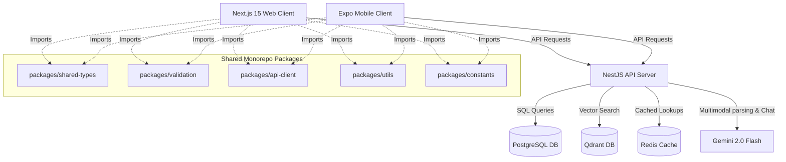

# Hospitality SaaS Platform: Frontend & Systems Flow Specification (`site.md`)

This document serves as the master specification for both the **Next.js Web Client** and the **Expo React Native Mobile Client** monorepo. It details code structures, page files, shared packages, data types, and core backend integrations.

---

## 🗺️ High-Level System Architecture

The platform uses a monorepo structure managed by **Yarn Workspaces** and **Turborepo** to share interfaces, API clients, and validation schemas.

---

## 📦 Monorepo Shared Packages (`packages/`)

These packages compile into unified ES Modules used by both Next.js and React Native clients.

### 1. `shared-types`
* **Path:** [packages/shared-types/index.ts](file:///Users/nidhigokani/Documents/hospitality-fe/packages/shared-types/index.ts)
* **Key Interfaces:**
  * `User`: Defines name, email, and roles (`owner`, `gm`, `chef`, `accountant`).
  * `Supplier`: Vendor properties including minimum order limits and payment terms.
  * `SuppliedProduct`: Represents catalog ingredients and current wholesale costs.
  * `Recipe`: Comprises target cost metrics, portion yields, and profit margins.
  * `Invoice` & `InvoiceLine`: Details parsed documents and matched product catalog links.
  * `StaffMember` & `StaffShift`: Profiles and clock-in/out payroll values.
  * `OperationalIncident`: Logs exceptions (e.g. price spikes, waste, labor cost leaks).

### 2. `validation`
* **Path:** [packages/validation/index.ts](file:///Users/nidhigokani/Documents/hospitality-fe/packages/validation/index.ts)
* **Zod Validation Schemas:**
  * `LoginSchema`: Enforces valid emails and minimum 6-character passwords.
  * `InviteUserSchema`: Validates onboarding staff forms.
  * `SupplierSchema` & `SuppliedProductSchema`: Sanitizes new catalog setup forms.
  * `RecipeSchema`: Ensures ingredients are structured with quantities.
  * `StaffMemberSchema` & `StaffShiftSchema`: Enforces schedule bounds.
  * `WasteLogSchema` & `PriceDisputeSchema`: Validates loss and invoice adjustments.

### 3. `api-client`
* **Path:** [packages/api-client/index.ts](file:///Users/nidhigokani/Documents/hospitality-fe/packages/api-client/index.ts)
* **Key Functionality:**
  * Connects client applications to the NestJS API gateway (`http://localhost:8000/api/v1`).
  * Implements **Axios Interceptors** to attach Bearer tokens on outgoing request headers.
  * Handles token refreshes by intercepting `401 Unauthorized` responses and initiating token exchanges.

### 4. `utils` & `constants`
* **Paths:** [utils/index.ts](file:///Users/nidhigokani/Documents/hospitality-fe/packages/utils/index.ts) & [constants/index.ts](file:///Users/nidhigokani/Documents/hospitality-fe/packages/constants/index.ts)
* **Key Functionality:**
  * `formatCurrency`: Standardizes currency formatting across screens.
  * Metric thresholds (e.g. `LABOR_COST_LIMIT_PERCENTAGE = 30%`).

---

## 🖥️ Web Client Page Functionality (`apps/web`)

The Next.js 15 App Router manages all large-screen configuration modules, audits, and settings pages.

### Page Routing Table

| Route Path | Active Page Component | Description / Actions |
| :--- | :--- | :--- |
| `/` | [page.tsx](file:///Users/nidhigokani/Documents/hospitality-fe/apps/web/app/page.tsx) | **Sign-In:** Validates inputs using `LoginSchema`, stores tokens in `useAuthStore` Zustand client, and redirects to `/dashboard`. Responsive layout with background gradient decor. |
| `/dashboard` | [page.tsx](file:///Users/nidhigokani/Documents/hospitality-fe/apps/web/app/dashboard/page.tsx) | **Overview:** Metrics ribbons (Spend, Margin, Labor Ratio, Open Incident count). Siri RAG chatbot input panel (`POST /chat/query`). Live incident feeds with action resolution buttons. |
| `/dashboard/invoices` | `/invoices/page.tsx` | **Invoices & OCR:** Lists processed invoices (`apiClient.getInvoices()`). Drag-and-drop file upload triggers (`POST /invoices/upload`) and maps line item confirmations. |
| `/dashboard/recipes` | `/recipes/page.tsx` | **Recipes & Margins:** Lists recipe names, portion costs, sale prices, actual margins, and warning limits. Highlights margin drops. |
| `/dashboard/labor` | `/labor/page.tsx` | **Staff & Labor:** Lists staff members, clock-in statuses, and shifts. Daily labor audit panel evaluates schedule payrolls against estimated sales (`POST /labor/audit`). |
| `/dashboard/incidents` | `/incidents/page.tsx` | **Exceptions & Disputes:** Log of operational incidents (Price spikes, waste, labor cost leaks) with dispute and resolution buttons (`PUT /incidents/:id/resolve`). |

---

## 📱 Mobile Client Page Functionality (`apps/mobile`)

The React Native Expo client manages active warehouse uploads, clock-ins, and voice queries.

### 1. Login Gate View
* **File:** [App.tsx](file:///Users/nidhigokani/Documents/hospitality-fe/apps/mobile/App.tsx)
* **Logic:** Renders login form styled with Tailwind (NativeWind). Authenticates with the backend and transitions to `<Dashboard />` upon receipt of session tokens.

### 2. Dashboard View
* **File:** [Dashboard.tsx](file:///Users/nidhigokani/Documents/hospitality-fe/apps/mobile/components/Dashboard.tsx)
* **Widgets:**
  * **Spend & Labor Metric Cards:** Responsive NativeWind tiles showing status metrics.
  * **Active Incident Timeline:** Displays warning alerts with single-tap "Mark Resolved" triggers.
  * **Siri Voice / RAG Assistant:** Features an interactive microphone action. Shaking or pressing the trigger translates speech to text, posts query strings to `/chat/query` (with Redis caching on backend), and outputs spoken TTS answers.

---

## ⚠️ Code-to-Schema Type Reconciliation

> [!WARNING]
> **Relational Key Datatype Mismatch:**
> There is a data-type mismatch between the shared frontend validation schemas/types and the backend Postgres database model:
> 
> * **PostgreSQL / Prisma Database:** Generates primary/foreign keys as **Autoincrement Integers (`Int`)** (e.g., `recipeId`, `productId`, `invoiceId`).
> * **Zod Validation & Shared Types:** Historically define relations and IDs as **Strings or UUIDs (`z.string().uuid()`)**.
> 
> **Reconciliation Strategy during Integration:**
> * When posting from the frontend forms, IDs must be clean numeric representations or converted before Zod parsing, OR validation schemas must utilize `.coerce.number()` or `.transform()` to convert incoming form variables into integers.
> * Database response integers are cast back to string representations when hydrating client-side Zustand store hooks to maintain interface compilation compliance.
